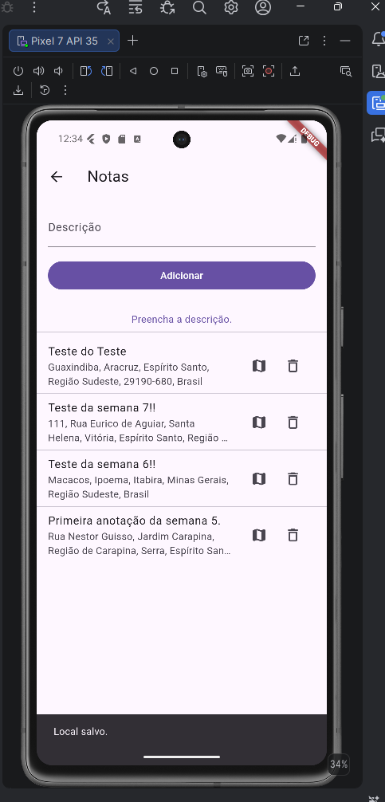
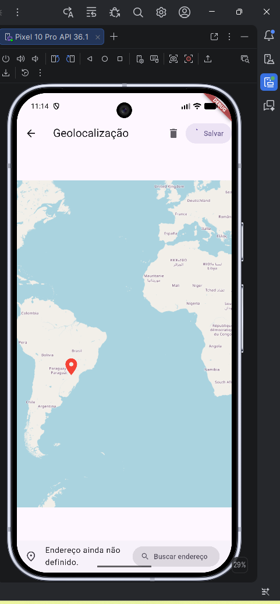
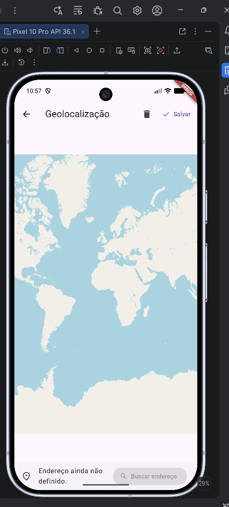
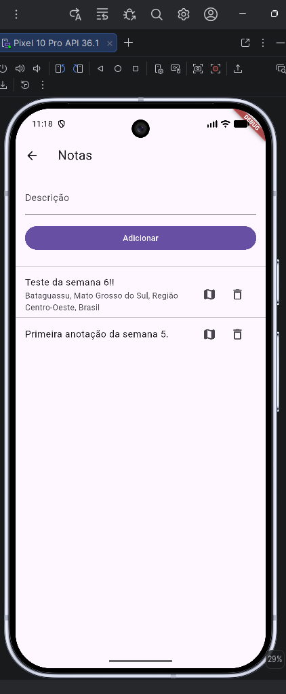

# 🔥 FirebaseApp - Semana 7

Atividade desenvolvida para a disciplina **Desenvolvimento de Aplicativos II**.

## 📌 Objetivo da semana

Nesta sétima semana, o objetivo foi adicionar recursos de geolocalização ao aplicativo Flutter.

O aplicativo passou a permitir que o usuário selecione uma localização no mapa, consulte o endereço correspondente e salve essa informação junto com a anotação no Cloud Firestore.

## ✅ O que foi realizado

- Criação da branch **semana7**
- Instalação do pacote **flutter_map**
- Instalação do pacote **latlong2**
- Instalação do pacote **http**
- Instalação do pacote **geoflutterfire_plus**
- Criação do arquivo **lib/maps.dart**
- Criação da tela de geolocalização
- Exibição do mapa utilizando OpenStreetMap
- Inclusão de marcador para selecionar uma localização
- Utilização do gesto de toque e movimento no mapa
- Consulta de endereço por geocodificação reversa
- Exibição do endereço selecionado na tela
- Salvamento da localização e do endereço junto com a anotação
- Exibição do endereço salvo na lista de anotações
- Inclusão de um botão de mapa para consultar a localização de cada anotação
- Teste do aplicativo no emulador Pixel 7
- Publicação da branch **semana7** no GitHub

## 🚀 Tecnologias utilizadas

- 🐦 Flutter
- 🎯 Dart
- 🔥 Firebase
- 🔐 Firebase Authentication
- 🗄️ Cloud Firestore
- 🗺️ Flutter Map
- 🌍 OpenStreetMap
- 📍 Geolocalização
- 🔎 Geocodificação reversa
- 🧩 FlutterFire CLI
- 💻 Visual Studio Code
- 🟢 Android Studio
- 🌱 Git
- 🐙 GitHub
- 📱 Android Emulator

## 🗺️ Configuração do mapa

O mapa foi implementado no arquivo:

```text
lib/maps.dart
```

Foi utilizado o pacote `flutter_map` com o servidor público de tiles do OpenStreetMap:

```text
https://tile.openstreetmap.org/{z}/{x}/{y}.png
```

O usuário pode tocar no mapa para posicionar o marcador. A localização selecionada é armazenada em coordenadas de latitude e longitude.

## 📍 Geocodificação reversa

Depois que uma localização é selecionada, o aplicativo consulta a API do Nominatim para converter as coordenadas em um endereço legível.

Para identificar corretamente o aplicativo durante a consulta, foi utilizado o seguinte cabeçalho:

```text
'User-Agent': 'FirebaseApp/1.0 (robinho.ufes@gmail.com)'
```

O endereço retornado é exibido na tela de geolocalização e pode ser salvo junto com a anotação.

## 🔥 Dados salvos no Firebase

Além da descrição da anotação, foram adicionados campos para armazenar a localização:

```text
latitude
longitude
address
```

Quando a anotação possui uma localização salva, a lista de notas exibe o endereço resumido e um botão para abrir novamente o mapa.

## ▶️ Comandos utilizados

Instalação dos pacotes:

```bash
flutter pub add flutter_map
flutter pub add latlong2
flutter pub add http
flutter pub add geoflutterfire_plus
```

Execução do aplicativo no emulador Pixel 7:

```bash
flutter run --no-enable-impeller -d emulator-5554
```

Publicação da branch no GitHub:

```bash
git add lib/maps.dart lib/notes.dart pubspec.yaml pubspec.lock linux/flutter/generated_plugins.cmake windows/flutter/generated_plugins.cmake
git commit -m "Semana 7"
git push -u origin semana7
```

## 📁 Arquivos alterados/criados

Durante a atividade, foram utilizados principalmente os arquivos:

```text
lib/maps.dart
lib/notes.dart
pubspec.yaml
pubspec.lock
linux/flutter/generated_plugins.cmake
windows/flutter/generated_plugins.cmake
```

## 📸 Evidências da execução

### Tela de anotações no Pixel 7



### Mapa com marcador



### Tela inicial de geolocalização



### Endereço salvo na anotação



## 🧪 Resultado obtido

O aplicativo foi executado com sucesso no emulador **Pixel 7**, utilizando Android 15 e API 35.

Após entrar no aplicativo, acessar **Anotações** e criar uma nova anotação, foi possível:

- Abrir a tela de geolocalização
- Navegar pelo mapa
- Selecionar uma localização
- Visualizar o marcador no mapa
- Consultar o endereço correspondente
- Salvar a anotação com a localização
- Visualizar o endereço na lista de anotações
- Abrir novamente o mapa pelo botão da anotação

Exemplo de anotação criada:

```text
Teste do Teste
Guaxindiba, Aracruz, Espírito Santo, Região Sudeste, 29190-680, Brasil
```

## 💬 Observações

Nesta etapa foram implementados recursos de mapas e localização. O aplicativo utiliza o OpenStreetMap para exibir o mapa e o serviço Nominatim para obter o endereço a partir das coordenadas selecionadas.

O teste principal foi realizado no Pixel 7, onde o login, o carregamento das anotações, a criação de uma nova anotação e o salvamento dos endereços funcionaram corretamente.

## 👨‍💻 Autor

Robson Silva Ribeiro

## 🔗 Repositório

[https://github.com/Robson-ifes/FirebaseApp](https://github.com/Robson-ifes/FirebaseApp)

## 🌿 Branch da atividade

```text
semana7
```
